# IA - TD (Professeur : Pierre Andry)

---

Pour ce long TD d'Intelligence Artificielle, le choix du langage Python s'est imposé pour plus de simplicité et plus d'aisance pour ma part.

## TD1 - Partie 1

Pour notre introduction à l'IA, nous allons construire un premier réseau de neurone:
- Couche d'entrée de 48 neurones car nous travaillons sur des images de 8*6 pixels
- Couche de sortie d'un unique neurone qui dira lors des tests si l'image était un 0 ou un 1

Le but ici est donc d'entrainer le modèle avec une base de données composée uniquement de 2 images (0.txt et 1.txt). Pour chaque itération d'entrainement, nous vérifions si oui ou non le modèle est capable de reconnaitre un 0 et un 1 (ceci est notre condition d'arrêt pour l'apprentissage du modèle).<br>
Dès que le modèle est entrainé (il faut entre 4 et 10 itérations en moyenne pour l'entrainement), nous passons à la phase de test du modèle avec un bruitage qui va augmenter petit à petit (voir graphique ci-dessous).

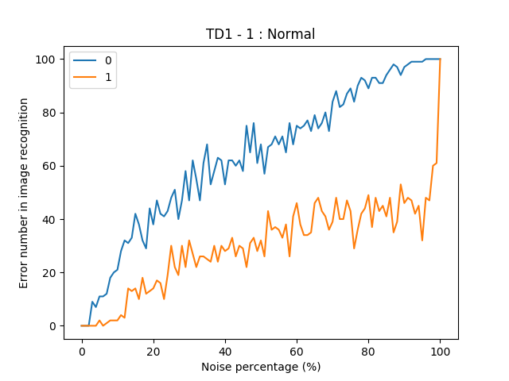

### Remarques

- Le modèle entrainé commet très peu d'erreurs avec un bruit < 30%
- L'utilisation de ce modèle n'est donc plus fiable à partir d'un buitage > 30%
- Les tests sont effectués sur chaque pourcentage (de 0 à 100%) avec pour chacun 100 images bruitées (prises aléatoirement entre 0.txt et 1.txt)

## TD1 - Partie 2 : Widrow-Hoff (sur uniquement 2 classes : 0 et 1)

Lors de cette seconde partie, nous avons conserver un apprentissage sur uniquement 2 classes mais ce qui a évolué par rapport à la première partie est le calcul de l'erreur qui doit au cours de l'apprentissage diminuer jusqu'à atteindre très petit (sans toucher le 0).<br>
Le graphe ci-dessous montre bien l'évolution de l'erreur au cours du temps avec en abscisse le nombre d'itérations et en ordonnée l'erreur en pourcentage.

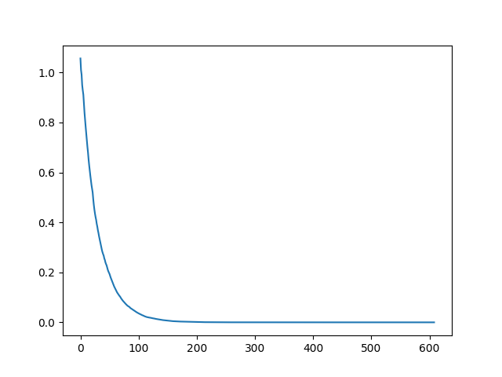

### Remarques

- Evolution de l'erreur du modèle au cours de son apprentissage
- A partir de 200 itérations, le modèle est quasi parfait pour être utilisé
- Le modèle est arrêté quand son err < 10⁻⁶, sans cette étape d'arrêt, le modèle partirait dans une boucle infinie sans jamais atteindre un erreur égale à 0

Après l'entrainement du modèle, nous choisissons de tester notre modèle avec différents niveaux de bruitage (similaire aux tests de la partie 1).

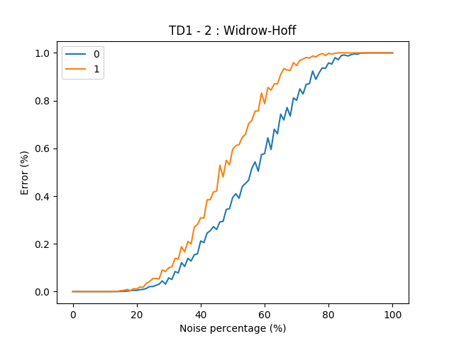

### Remarques

- Représentation de l'évolution de l'erreur selon différents niveaux de bruitage
- Modèle entrainé beaucoup plus robuste et fiable que le précédent
- Jusqu'à 20% de bruitage, le modèle ne commet aucune erreur

## TD1 - Partie 3 : Widrow-Hoff (généralisation sur 10 classes : de 0 à 9)

Pour cette avant dernière partie, nous faisons évoluer notre base de données initiale de 2 à 10 classes correspondants aux nombres de 0 à 9. Le tableau des poids sera ici amené à évoluer en 10*48:
- 48 neurones d'entrée pour les pixels de chaque images (8 * 6 pixels)
- 10 neurones de sortie pour chaque classe représentée

Le graphe ci-dessous représente le calcul de l'erreur totale du modèle lors de son entrainement. La condition d'arrêt est *erreur < 10⁻⁶*. Nous aurions pu choisir une erreur un peu plus grande comme 0.01 mais le choix de cette valeur nous a permis d'obtenir des taux de reconnaissance des 10 nombres de bonne qualité.

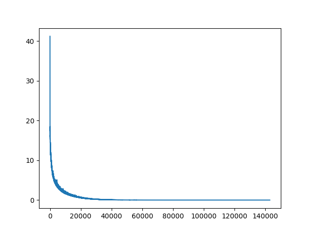

### Remarques

- Evolution de l'erreur du modèle au cours de son apprentissage
- A partir de 2500 itérations, le modèle est quasi parfait pour être utilisé
- Le modèle est arrêté quand son err < 10⁻⁶ (arrêté à la 142916ème itération); sans cette étape d'arrêt, le modèle partirait dans une boucle infinie
- Valeurs utilisées : Epsilon : 0.01 et Theta : 0.5

### Problème rencontré

Le modèle fonctionnait parfaitement bien jusqu'au nombre 8 et permettait un apprentissage rapide et fiable.
Lors de l'ajout du nombre 9, l'apprentissage était très long et l'erreur variait beaucoup sans vraiment se rapprocher d'une erreur à 10⁻⁶ demandé (condition d'arrêt); Nous étions dans le cas d'une boucle infinie.

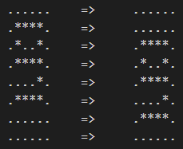

Le nombre 9 étant très proche des nombres 0, 3, 6 et 8, j'ai choisi de décaler tout le nombre 9 d'un pixel vers le bas afin qu'il n'y ait plus de corrélation avec les nombres cités ci-dessus.
Ce choix a été concluant car dès le premier essai, nous avons obtenu un modèle robuste permettant de reconnaitre les nombres de 0 à 9.

## Test du modèle entrainé

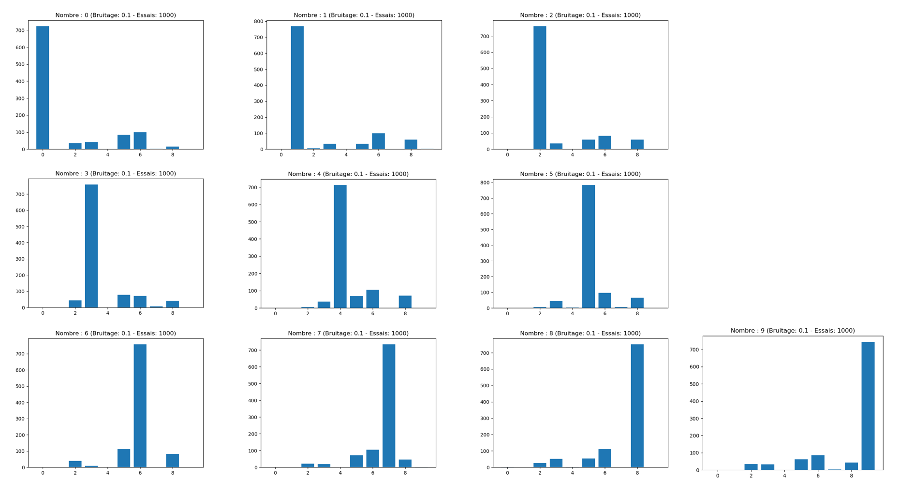

### Caractéristiques

- Bruitage de 10% des images
- 1000 essais par nombre (0 à 9)

### Remarques

Les graphes ci-dessus ont été générés à partir de 1000 tests avec un bruitage de 10%. <br>
Nous pouvons remarquer que le bruitage de 10% vient altérer la détection des différents nombres.<br>
<br>
Par ailleurs, après analyse des graphes ci-dessus, nous pouvons remarquer que certains nombres se recoupent logiquement comme :

- le nombre 0 avec le nombre 6 (resp. 72% et 10%)
- le nombre 6 avec le nombre 5 (resp. 75% et 12%)
- le nombre 8 avec le nombre 6 (resp. 73% et 12%)


## Partie 4 - MNIST modèle

L'objectif ici était d'entrainer un réseau de neurones composée de 3 couches dont une cachées :
- 1ère couche (input) de 784 neurones car on utilise des images de 28*28 neurones
- 2ème couche (cachée) de 100 neurones
- 3ème couche (output) de 10 neurones représentant ainsi nos 10 classes (de 0 à 9)

Nous avons ainsi utilisé la base de données MNIST qui contient 60000 images pour l'entrainement du modèle ainsi que 10000 images pour tester le modèle entrainé.

Concernant EPSILON, nous le faisions varier de telle sorte à optimiser la vitesse d'apprentissage. Au départ nous le fixions à 1 puis on le divisait par 10 à chaque fois qu'un pallier était atteint par l'erreur totale.

Lors de l'entrainement du modèle, nous calculions toutes les 1000 itérations une erreur sur un échantillon de 100 images toutes tirées aléatoirement. A partir de ces 100 images nous calulions pour chacune son erreur. Ainsi nous avions une erreur totale (voir figure ci dessous) qui diminuait au cours du temps.

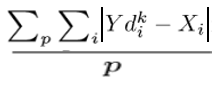

A partir du calcul de l'erreur totale toutes les 1000 itérations, nous avons obtenu un graphe d'erreurs totales qui diminue jusqu'à atteindre la barre des 80% pour environ 200000 itérations.

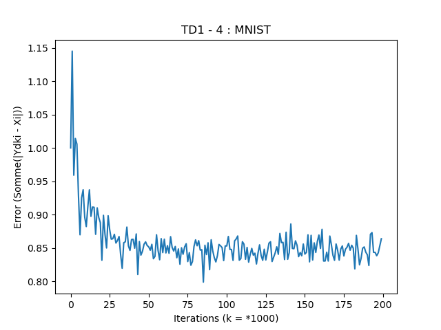

Au bout des 200000 itérations d'entrainement, nous avons donc testé notre modèle sur la base de données de test (10000 images qui sont inconnues pour le modèle entrainé). Ainsi, sur ces 10000 images, le taux de reconnaissance final obtenu est d'environ 91%

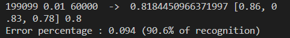

### Tests réalisés sur le modèle

Il a été remarqué qu'avec un entrainement du modèle avec 200000 itérations, il était possible d'atteindre un taux de reconnaissance des images de test de 91%. Ainsi des tests ont été effectués pour voir si un entrainement plus long pourrait contribuer à de meilleures performance.
Des tests ont été menés avec des nombres d'itérations beaucoup plus élevés pour voir le comportement de l'erreur.

Par exemple sur 2 millions d'itérations, nous avons pu remarquer que l'erreur totale oscillait entre 80% et 87%. Donc l'évolution était plus constante que décroissante. Lors du test du modèle, nous avons remarqué que le taux de reconnaissance (91.2%) était lui aussi très proche des résultats obtenus ci-dessus.

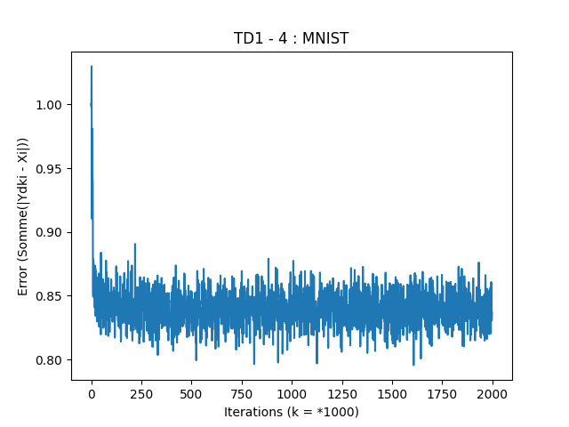

C'est pourquoi nous avons choisi de tenter à nouveau notre chance sur un entrainement à 20 millions d'itérations avec une condition d'arrêt (si l'erreur est inférieure à 78%) qui n'a jamais été atteinte. Après ces 20 millions d'itérations, confronter le modèle entrainé à la base de tests nous a révélé que le taux de reconnaissance n'avait que très peu changé pour atteindre les 91.5% de reconnaissance.

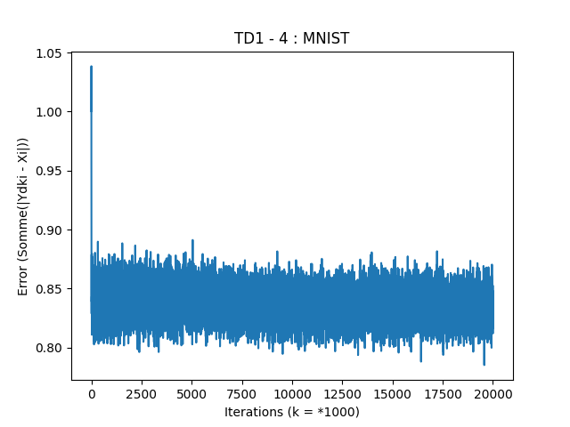
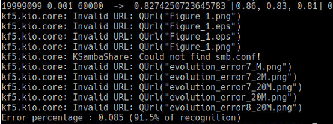

Le meilleur score sera obtenu avec un modèle entrainé sur 10 millions d'itérations où le taux de reconnaissance sur les 10000 images de la base de tests aura été de 92%.

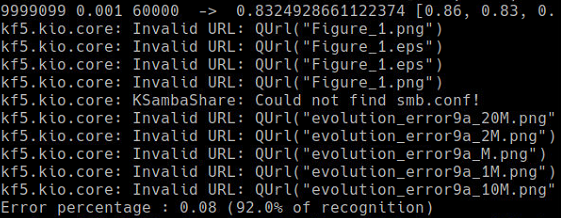

### Problèmes de performances rencontrés

Ce cours d'intelligence artificiel a débuté avec l'entrainement d'un modèle sur 2 images (0.txt et 1.txt) puis nous sommes passés à l'entrainement d'un modèle sur 10 images (0 à 9). Jusque là, le code pouvait être "sale", nos machines performantes ne semblaient pas rencontrer de problèmes de performance lors de l'entrainement du modèle.
Lors du passage d'une base de données de 10 images à 60000, l'optimisation du code à tout de suite pris de l'importance.

Mon premier objectif pour cette dernière partie était d'obtenir un modèle qui tourne et qui puisse apprendre quelque soit son optimisation. Pour vérifier son fonctionnement je le faisais travailler sur les 100 premières images de la base de données fournie (celle de 60000 images). Après avoir vérifier le bon fonctionnement du code, j'ai choisi de travailler non plus sur 100 images mais bel et bien sur les 60000 images de la base de données et c'est là que les problèmes sont apparus. LE MODELE ETAIT TRES LONG LORS DE L'APPRENTISSAGE !!

J'ai donc commencé à m'intéresser à l'optimisation du code en utilisant tout simplement des calculs des temps d'exécution (voir code ci-dessous). Ces temps d'exécution m'ont permis de rapidement comprendre les endroits du code les plus lents à s'exécuter.

```python
import time
tic = time.perf_counter()
# Code dont nous voulons calculer le temps d'exécution (par exemple le traitement d'une image dans son intégralité)
toc = time.perf_counter()
print(f"1 image => {toc - tic:0.4f} seconds")
```

Il semble logique que sur des matrices 100 * 784 et 10 * 100, les calculs matriciels (mal codés) peuvent vite engendrer de grosses pertes de temps. J'ai repéré ainsi les endroits les plus critiques et nous allons étudier ici la partie de l'**apprentissage** (concernant la plus grosse matrice : 100 * 784) qui était pour moi la plus lente dans le code.

### Etude du cas de l'optimisation du code lors de l'apprentissage de la matrice 100*784

#### Etape 1 - les deux boucles for sur une matrice 100*784
Le code initial était une double boucle qui parcourait les 78400 cases de la matrices afin de les mettre à jour. L'utilisation des boucles for pour le calcul matriciel sur de tels matrices n'est pas très conseillé pour des questions de performances.<br>
Le temps utilisé pour cette première étape était : **0.07s / image** (ce qui équivaut à **70 secondes pour 1000 images**)

```python
for i in range(len(sigmaI)):
    for h in range(len(Xh)):
        weightL2[i][h] += EPSILON * sigmaI[i] * Xh[h]
```

#### Etape 2 - L'utilisation de numpy
Ainsi m'est venu l'idée d'utiliser la fameuse librairie *numpy* très connue pour ses calculs matriciels optimisés et pour éviter le problème ci-dessus des boucles for qui parcourent lentement toute la matrice.

Le code ci-dessous permet ainsi de refaire comme le code de l'étape 1 mais en beaucoup plus rapide.<br>
Ici, nous créons avec numpy 2 matrices de tailles 100\*764 de même taille  que weightL2 et on applique finalement la formule (voir dernière ligne du code ci-dessous) pour mettre à jour le tableau des poids.<br>
Le temps utilisé pour cette seconde étape était : **0.0056s / image** (ce qui équivaut à **5.6 secondes pour 1000 images**)

```python
import numpy as np
XhSize = len(Xh)
Xh = np.tile(Xh, (len(sigmaI),1))
sigmaI = np.array(XhSize*[sigmaI])
sigmaI = np.swapaxes(sigmaI, 0, 1)
weightL2 += EPSILON *  Xh * sigmaI
```

#### Etape 3 - Utilisation plus maligne de numpy
Beaucoup plus performante, cette seconde étape montrait tout de même des signes de fragilité qui pouvaient facilement s'expliquer par le fait qu'on redimentionnait à chaque fois SigmaI et Xh en matrice de 100*784. Cette génération entrainait aussi des potentielles pertes de performance.

C'est pourquoi nous avons décidé l'utiliser l'outil de transposition de numpy afin de ne pas avoir à redimentionner sigmaI ce qui fut à nouveau un gain de temps incroyable pour les temps de performance.<br>
Le temps utilisé pour cette dernière étape était : **0.0006s / image** (ce qui équivaut à **0.6 seconde pour 1000 images**)

```python
import numpy as np
Xh = np.tile(Xh, (len(sigmaI),1))
weightL2 += EPSILON *  Xh * np.transpose(np.array([sigmaI,]))
```

L'optimisation du code de l'apprentissage (que vous pourrez retrouver dans le code) s'arrête là pour cette partie et nous a permis de gagner énormément de temps pour les tests et donc de pouvoir faire des entrainements sur plusieurs millions d'itéations (jusqu'à 20 millions).


#### Conclusion de l'optimisation de cette partie
L'optimisation est un domaine qui doit toucher tout bon développeur et particulièrement ceux issus comme nous de l'informatique embarquée où les capacités des produits sur lesquels nous seront amenés à travailler sont très réduites. Il est donc important de garder à l'esprit qu'optimiser son code est primordiale pour gagner en efficacité et ne pas perdre de temps inutilement.

Cette optimisation nous a permis de pouvoir tester notre modèle avec un nombre d'itérations très important (plusieurs millions) afin de voir l'évolution ou non du modèle entrainé.<br>
Malheureusement, cette évolution n'a pas eu lieu et nous sommes restés à un taux de reconnaissance toujours aux alentours de 91% de la base de test.

Bilan personnel :<br>
Ce cours extrêmement intéressant m'a permis d'une part de faire mes premiers pas en IA et de très bien comprendre le fonctionnement des réseaux de neurones. La construction intégrale de nos propres réseaux de neurones était un bon moyen de bien comprendre leur fonctionnement.<br>
Par ailleurs, la partie 4 du projet nous a permis de nous confronter directement aux problèmes de performance du code nous obligeant ainsi à optimiser le code en utilisant la librairie *numpy* très utile pour les calculs matriciels.<br>
Je remercie ainsi Monsieur Pierre Andry pour son professionnalisme et sa capacité à délivrer un cours de très bonne qualité aux élèves d'INEM.
