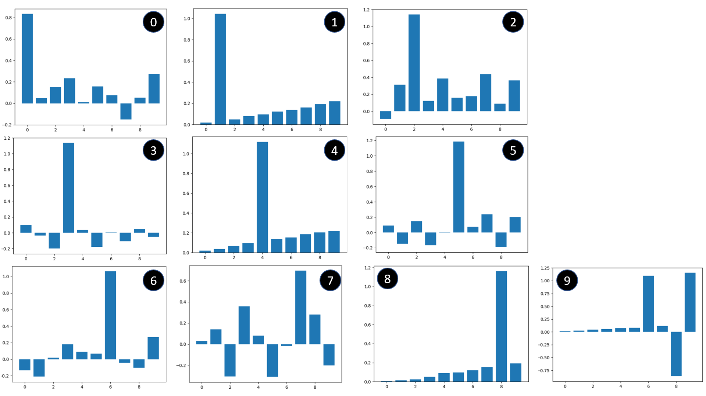

# IA - TD (Professeur : Pierre Andry)

---

## TD1 - Question 1

### Remarques

- Le modèle entrainé commet très peu d'erreurs avec un bruit < 30%
- L'utilisation de ce modèle n'est donc plus fiable à partir d'un buitage > 30%

## TD1 - Question 2 : Widrow-Hoff (sur uniquement 2 classes : 0 et 1)

### Remarques

- Evolution de l'erreur du modèle au cours de son apprentissage
- A partir de 200 itérations, le modèle est quasi parfait pour être utilisé
- Le modèle est arrêté quand son err < 10⁻⁶, sans cette étape d'arrêt, le modèle partirait dans une boucle infinie

### Remarques

- Modèle entrainé beaucoup plus robuste et fiable que le précédent
- Jusqu'à 20% de bruitage, le modèle ne commet aucune erreur

## TD1 - Question 3 : Widrow-Hoff (généralisation sur 10 classes : de 0 à 9)

### Remarques

- Evolution de l'erreur du modèle au cours de son apprentissage
- A partir de 2500 itérations, le modèle est quasi parfait pour être utilisé
- Le modèle est arrêté quand son err < 10⁻⁶, sans cette étape d'arrêt, le modèle partirait dans une boucle infinie (arrêté à la 142916ème itération)
- Valeurs utilisées : Epsilon : 0.01 et Theta : 0.5

### Problème rencontré

Le modèle fonctionnait parfaitement bien jusqu'au nombre 8 et permettait un apprentissage rapide et fiable.
Lors de l'ajout du nombre 9, l'apprentissage était très long et l'erreur variait beaucoup sans vraiment se rapprocher d'une erreur à 10⁻⁶ demandé (condition d'arrêt); Nous étions dans le cas d'une boucle infinie.

Le nombre 9 étant très proche des nombres 0, 3, 6 et 8, j'ai choisi de décaler tout le nombre 9 d'un pixel vers le bas afin qu'il n'y ait plus de corrélation avec les nombres cités ci-dessus.
Ce choix a été concluant car dès le premier essai, nous avons obtenu un modèle robuste permettant de reconnaitre les nombres de 0 à 9.

## Test du modèle entrainé

### Caractéristiques

- Bruitage de 10% des images
- 1000 essais par nombre (0 à 9)

### Remarques

Les graphes ci-dessus ont été générés à partir de 1000 tests avec un bruitage de 10%.  
Nous pouvons remarquer que le bruitage de 10% vient altérer la détection des différents nombres. 
 
Par ailleurs, après analyse des graphes ci-dessus, nous pouvons remarquer que certains nombres se recoupent logiquement comme :

- le nombre 0 avec le nombre 6 (resp. 72% et 10%)
- le nombre 6 avec le nombre 5 (resp. 75% et 12%)
- le nombre 8 avec le nombre 6 (resp. 73% et 12%)

<!-- ### Les valeurs des 10 ouptuts du modèle après entrainement

### Remarques

- Voici le modèle après entrainement pour chaque nombre
- Une tendance très nuancé se dégage pour chaque nombre
- Nous pouvons remarquer quel le N°9 est en ambiguité avec le n°6
- Ce modèle ne fait que peu de fautes et semble bien robuste pour la reconnaissance des nombres de 0 à 9 -->
